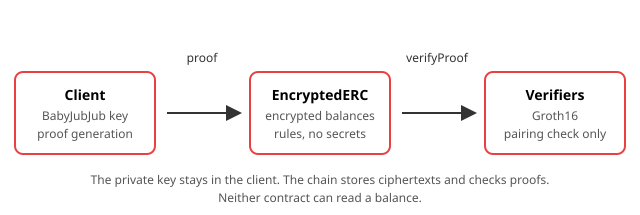

# Deploy Your Own eERC Token

## Overview

In this workshop you set up a Circom toolchain, compile the five zero-knowledge circuits behind the Encrypted ERC (eERC) standard, generate their Solidity verifiers, and deploy a complete private token to Fuji C-Chain. You then register a user, mint encrypted tokens, read a balance only you can decrypt, and send a private transfer. By the end you have a token whose balances are unreadable on-chain, and you know which part of the system enforces that.

The workshop deploys in **standalone mode**: a new private token whose supply is managed by mint and burn. Converter mode, which wraps an existing ERC-20, uses the same circuits and is covered in Part 14.



## Learning objectives

- Install and verify a Circom toolchain, and explain what `hardhat zkit` does on your behalf.
- Compile Circom circuits to R1CS and generate Groth16 verifier contracts from them.
- Explain why a downloaded Powers of Tau and zero contributions are acceptable for a testnet and not for mainnet.
- Deploy the eERC contract set to Fuji and name what each of the eight deployed addresses does.
- Register a BabyJubJub keypair on-chain without the private key leaving your machine.
- Mint, read, decrypt and privately transfer an encrypted balance.
- Read a transfer circuit and name what it proves, including the auditor's role in it.
- State three specific things this deployment lacks compared with production eERC.

## Prerequisites

- Completed [Build Your First dApp](../../build-your-first-dapp/en/README.md), including a Core wallet on Fuji with test AVAX from [Getting Started with Avalanche](../../getting-started/en/README.md).
- Comfortable deploying and calling a Solidity contract without following a tutorial. [Hackathon Prep with Avalanche](../../hackathon-prep/en/README.md) covers the deployment loop if you want it first.
- Useful but not required: [Sealed-bid Auctions on a Public Blockchain](../../sealed-bid-auctions/en/README.md) demonstrates by experiment that `private` in Solidity is a visibility rule and not encryption. This workshop is the encryption answer to the problem it sets up.
- Node.js 22 or newer. The repository pins `v22.14.0` in `.nvmrc`. Node 18 reached end of life in April 2025 and will not work.
- Git, a terminal and a text editor.
- A dedicated test wallet. Never use a wallet that holds real funds in a workshop.
- Roughly 4 GB of free disk space. Circuit compilation is the heaviest step in this workshop.

Zero-knowledge theory is not a prerequisite. The concepts are introduced where they are used. If you want the full treatment of proof systems, circuits and commitments, the ZK Fundamentals course on Avalanche Academy covers them, and the eERC Token Standard course covers what eERC does and why.

**Facilitators: prepare before the session.** Parts 2 to 5 download several hundred megabytes and compile five circuits. On shared campus bandwidth this can take longer than a lab slot allows. Have participants complete Parts 2 to 5 beforehand, or run them from a pre-warmed clone on a local mirror.

## Workshop

### Part 1: What you are building

An eERC deployment has three layers.

| Layer | Holds | Knows |
|---|---|---|
| Client | The BabyJubJub private key | Plaintext balances and amounts |
| Token contract | Encrypted balances and the rules | No plaintext value, ever |
| Verifier contracts | Nothing | Whether a proof is valid |

The client encrypts, decrypts and generates proofs. The token contract stores ciphertexts and enforces rules. The verifier runs a pairing check and returns a boolean.

Two deployment modes exist:

| | Standalone | Converter |
|---|---|---|
| Token origin | New, private from the first mint | Wraps an existing ERC-20 |
| Supply managed by | `privateMint` and `privateBurn` | `deposit` and `withdraw` |
| Total supply | Private throughout | Inferable from the wrapped reserve |
| Use when | The asset is private by design | An existing public token needs privacy |

This workshop builds standalone. `deposit()` exists on the contract but **reverts in standalone mode** — that is not a bug, and Part 10 revisits it.

What is actually visible on-chain: a public key at registration, a mint the owner performs, and after that nothing but ciphertexts and proofs. Privacy here means amounts and balances, not the existence of a transaction. Transaction senders, recipients and timing remain public.

### Part 2: Environment and repository

```sh
node --version
# Expect v22.x or newer. Stop here if it is v18.

git clone https://github.com/ava-labs/EncryptedERC.git
cd EncryptedERC
npm install
npx hardhat compile
```

`npm install` pulls Hardhat 2, the Solarity zkit plugin, `poseidon-lite`, `@zk-kit/baby-jubjub` and the OpenZeppelin contracts. `npx hardhat compile` builds the Solidity in `contracts/` against solc 0.8.27 with the optimizer at 200 runs, and generates the TypeChain types the deployment scripts import.

If `npx hardhat compile` fails before you have touched anything, resolve that before continuing. A broken baseline makes every later error ambiguous.

### Part 3: Compiling the circuits

Five circuits live in `circom/`, one per privileged operation:

| Circuit | Proves |
|---|---|
| `registration.circom` | You own the private key for the public key you are registering |
| `mint.circom` | A mint is correctly encrypted under the recipient's key |
| `transfer.circom` | You can afford the amount, and every ciphertext is well formed |
| `withdraw.circom` | A withdrawal amount matches your encrypted balance |
| `burn.circom` | A burn correctly reduces your encrypted balance |

Compile them:

```sh
npx hardhat zkit make --force
```

Everything later depends on this step, and it does more than compile. `hardhat.config.ts` configures it under a `zkit` key:

| Setting | Value | What it means |
|---|---|---|
| `compilerVersion` | `2.1.9` | The Circom compiler version the plugin uses |
| `circuitsDir` | `circom` | Where the `.circom` sources live |
| `optimization` | `O2` | Constraint-level optimization during compilation |
| `ptauDownload` | `true` | Fetch Powers of Tau instead of running a ceremony |
| `provingSystem` | `groth16` | The proof system for the generated keys |
| `contributions` | `0` | Number of Phase 2 contributions to the trusted setup |

Two of those need naming plainly.

**The plugin manages the Circom compiler for you.** Circom is a Rust binary rather than an npm package, and installing it by hand means installing Rust and building from source. The zkit plugin is configured to use 2.1.9 and handles obtaining it. If it fails, install Circom manually from the [official installation guide](https://docs.circom.io/getting-started/installation/) and run the command again.

**A downloaded Powers of Tau with zero contributions is a development setup.** Phase 1 is circuit-independent, so downloading it is normal practice for testnet work. Phase 2 binds the setup to a specific circuit, and `contributions: 0` means nobody has contributed randomness to it. Anyone who holds the toxic waste from that setup can forge proofs your verifier will accept. This is fine on Fuji, where the tokens are worthless. Anything going to mainnet needs a ceremony whose participants you can account for.

This is the slowest step in the workshop and the most memory-hungry. The transfer circuit is the largest of the five.

### Part 4: From circuit to Solidity verifier

```sh
npx hardhat zkit verifiers
```

This writes one Solidity contract per circuit into `contracts/verifiers/`. They are generated code: the verification key is baked in as constants and the pairing check is implemented in assembly against the EVM precompiles. Never edit them, and never hand-tune them.

Open `contracts/verifiers/RegistrationCircuitGroth16Verifier.sol` and find `verifyProof`:

```solidity
function verifyProof(
    uint256[2] memory pointA_,
    uint256[2][2] memory pointB_,
    uint256[2] memory pointC_,
    uint256[5] memory publicSignals_
) public view returns (bool verified_)
```

`pointA_` and `pointC_` are G1 points. `pointB_` is a G2 point, which is a 2×2 array because G2 coordinates live in a quadratic field extension. The last argument is sized to that circuit's public signals, and the size differs per circuit:

| Verifier | Public signals |
|---|---|
| `RegistrationCircuitGroth16Verifier` | 5 |
| `WithdrawCircuitGroth16Verifier` | 16 |
| `BurnCircuitGroth16Verifier` | 19 |
| `MintCircuitGroth16Verifier` | 24 |
| `TransferCircuitGroth16Verifier` | 32 |

The pairing check runs on three precompiles, which is where the efficiency comes from:

| Address | Operation | Gas |
|---|---|---|
| `0x06` | `ecAdd` on BN254 G1 | 150 |
| `0x07` | `ecMul` on BN254 G1 | 6,000 |
| `0x08` | `ecPairing` | 45,000 + 34,000 per pair |

A verifier with a single public signal costs around 196,000 gas: one `ecMul`, one `ecAdd`, a four-pair pairing check, plus calldata and Solidity overhead. **None of eERC's circuits are that cheap** — the smallest has five signals and transfer has thirty-two. Extra signals add one `ecMul` and one `ecAdd` each and leave the pairing check untouched, so the cost grows slowly rather than proportionally. A full private transfer including balance updates and events typically lands between 300,000 and 400,000 gas.

The constraint count of a circuit affects proving key size and proving time. It has **no effect** on verification gas. That is why Groth16 is used for on-chain verification.

These precompiles behave identically on Fuji, C-Chain and Ethereum mainnet, so a verifier written for one deploys unchanged to the others.

### Part 5: Prove it works locally before spending gas

```sh
npx hardhat test test/EncryptedERC-Standalone.ts
```

This exercises the entire standalone flow against a local network: deploy, register, set an auditor, mint, transfer, burn, withdraw, and the revert cases. It uses the circuits and verifiers you just built, so a pass here means your toolchain is sound.

Run it before touching Fuji. A failure now is local and fast to diagnose. The same failure after deployment costs test AVAX and time.

Read `test/helpers.ts` while it runs. The functions there — `privateMint`, `privateTransfer`, `privateBurn`, `withdraw`, `decryptPCT`, `getDecryptedBalance` — are the reference client for every operation in Parts 8 to 12, and `test/user.ts` shows how a keypair is held.

### Part 6: Fuji account and configuration

Copy [env.example](../assets/env.example) to `.env` in the repository root and fill it in:

| Variable | Value |
|---|---|
| `PRIVATE_KEY` | Your dedicated test account's key |
| `RPC_URL` | `https://api.avax-test.network/ext/bc/C/rpc` |
| `EERC_NAME` | Your token's name |
| `EERC_SYMBOL` | Your token's symbol |
| `EERC_DECIMALS` | `2` unless you have a reason |

Set `RPC_URL` explicitly. The Hardhat config falls back to the **mainnet** endpoint when it is unset, and while the `fuji` network entry hardcodes its own URL, relying on that is a habit worth not forming.

Confirm the network before deploying:

```sh
cast chain-id --rpc-url "$RPC_URL"
# Expected: 43113. Stop if the network differs.
```

| Field | Value |
|---|---|
| Network name | Avalanche Fuji C-Chain |
| RPC URL | `https://api.avax-test.network/ext/bc/C/rpc` |
| Chain ID | `43113` |
| Currency symbol | `AVAX` |
| Explorer | `https://testnet.snowtrace.io` |

`.env` is already listed in the repository's `.gitignore`. Confirm that with `git status` before your first commit anyway. Never put a private key in slides, a repository, a chat or a screen share.

### Part 7: Deploy the stack

```sh
npm run deploy:fuji
```

That runs `scripts/deploy-standalone.ts` against Fuji. It deploys eight contracts and prints them as a table:

| Address | Role |
|---|---|
| `registrationVerifier` | Checks registration proofs |
| `mintVerifier` | Checks mint proofs |
| `withdrawVerifier` | Checks withdrawal proofs |
| `transferVerifier` | Checks transfer proofs |
| `burnVerifier` | Checks burn proofs |
| `babyJubJub` | Curve arithmetic library |
| `registrar` | Public key registry, holds the registration verifier |
| `encryptedERC` | The token itself, holds the other four verifiers |

Save all eight. You need `registrar` and `encryptedERC` for every later part.

Two details to understand before copying the script:

**BabyJubJub is deployed separately and linked.** It is a library whose functions use the `modexp` precompile at `0x05` for modular inversion, so it deploys as its own contract and `EncryptedERC` links against it at construction. That is why the factory in the script passes an explicit library mapping.

**The Registrar is a separate contract on purpose.** It is a public key registry, a PKI for the system. Splitting it out means one registry can serve several token contracts.

The constructor receives `isConverter: false`, which is what makes this a standalone token. Everything else is metadata and verifier addresses.

### Part 8: Register a user

Before anyone can hold a balance, they register a BabyJubJub public key. The proof establishes that they hold the matching private key without transmitting it.

`circom/registration.circom` takes five signals:

| Signal | Visibility | Value |
|---|---|---|
| `SenderPrivateKey` | Private | The formatted BabyJubJub private key |
| `SenderPublicKey[2]` | Public | The derived public key, two field elements |
| `SenderAddress` | Public | The EVM address registering |
| `ChainID` | Public | `43113` on Fuji |
| `RegistrationHash` | Public | `poseidon3([chainId, privateKey, address])` |

It runs two checks: `CheckPublicKey` confirms the public key derives from the private key, and `CheckRegistrationHash` confirms the hash commits to the chain ID, private key and address together. Then you call `registrar.register()` with the proof and public signals. The registration section of `test/EncryptedERC-Standalone.ts` shows the exact call shape.

Three things the circuit binds, and why each matters:

- **The chain ID.** Without it, a registration proof generated for Fuji would replay on mainnet. The contract checks the chain ID it was given matches its own.
- **The address.** Without it, anyone could register your public key against their own address.
- **The registration hash.** It commits to all three values at once, so none can be swapped independently.

The private key is used to generate the proof and is never transmitted. Nothing you send in this transaction reveals it. A second registration from the same address reverts — registration happens once.

### Part 9: Set the auditor

eERC has compliance built in. An auditor holds a key that lets them decrypt transaction data users encrypt for them, which makes selective disclosure possible without weakening privacy against everyone else.

```text
encryptedERC.setAuditorPublicKey(<auditor address>)
```

Owner only. The auditor address **must already be registered** in the Registrar, because the contract reads their public key from it.

**Every value-moving operation reverts until this is set.** The `onlyIfAuditorSet` modifier gates `privateMint`, `publicMint`, `privateBurn`, `transfer`, `deposit` and `withdraw`. This is the most common way a first eERC deployment appears broken: the contracts deployed cleanly, registration succeeded, and every token operation fails. Set it immediately after registration.

The modifier is only half of the enforcement. Part 12 shows the other half, which lives in the circuit.

For this workshop, registering your own second test account as the auditor is fine. In production, auditor selection and key rotation are governance decisions, not deployment details.

### Part 10: Mint private tokens

In standalone mode the owner creates supply with `privateMint`. The amount is encrypted under the recipient's registered public key before it ever reaches the chain.

The call signature, from the test suite:

```text
privateMint(address,((uint256[2],uint256[2][2],uint256[2]),uint256[24]))
```

Twenty-four public signals: the receiver's key and ciphertext, the auditor's encrypted summary, the chain ID and a nullifier hash. Use `privateMint` from `test/helpers.ts` to assemble them.

Two behaviours to try:

**The nullifier prevents replay.** Submit the same mint proof twice and the second attempt reverts with `InvalidNullifier`. A Groth16 proof carries no notion of who submitted it or when, so without an explicit nullifier an observer could resubmit any successful proof from the mempool.

**`deposit()` reverts here.** It carries an `onlyForConverter` modifier and reverts with `InvalidOperation` in standalone mode. Standalone supply comes from mint and burn; deposit and withdraw belong to converter mode, where a public ERC-20 reserve exists to move. Calling it here is a mode error, not a bug.

No plaintext amount appears in the transaction. Check it on the Fuji explorer and confirm that for yourself — the calldata is proof elements and ciphertexts.

### Part 11: Read and decrypt your balance

The contract stores your balance as an ElGamal ciphertext on BabyJubJub and cannot read it. Neither can anyone watching the chain. You read it by fetching the ciphertext and decrypting locally with your private key.

`getDecryptedBalance` in `test/helpers.ts` does both halves: fetch, then decrypt. `decryptPCT` decrypts the Poseidon ciphertext attached to a specific transaction.

Decryption recovers a value by searching the plausible plaintext range, which is why amounts are bounded rather than unlimited. eERC handles values up to 251 bits, and the practical range for fast decryption is far smaller. A scheme that allowed arbitrary balances would produce ciphertexts nobody could open.

Call it with the wrong key and you get nothing useful. That is the property working as intended, not an error to debug.

### Part 12: Private transfer

`privateTransfer` in `test/helpers.ts` generates the proof and submits it. The on-chain function is named `transfer`, not `privateTransfer` — the helper builds the proof and calls it.

Open `circom/transfer.circom`. It enforces eight things:

1. `ValueToTransfer` fits in 252 bits and is below the BabyJubJub subgroup order.
2. `ValueToTransfer <= SenderBalance`, written as `ValueToTransfer < SenderBalance + 1`.
3. `CheckPublicKey` — the sender's public key derives from their private key.
4. `CheckValue` — the stored ciphertext `SenderBalanceC1/C2` decrypts to `SenderBalance`.
5. `CheckValue` — the sender's own encryption of the amount, `SenderVTTC1/C2`, decrypts to `ValueToTransfer`.
6. `CheckReceiverValue` — the receiver's ciphertext encrypts the same amount under the receiver's key.
7. `CheckPCT` — the receiver's Poseidon ciphertext encrypts the amount.
8. `CheckPCT` — the auditor's Poseidon ciphertext encrypts the amount.

Three of those deserve attention.

**The circuit never computes the new balance.** There is no `newBalance === balance - amount` constraint, because the contract performs that subtraction on-chain, homomorphically, using `SenderVTT`. This is why the sender encrypts the amount twice: once under the receiver's key so the receiver can read it, and once under their own key so the contract can subtract it from a balance it cannot decrypt.

**Constraint 8 is the auditor, and it is not optional.** Part 9 gated operations with a modifier. This is the other half: the circuit refuses to produce a proof unless the amount is also encrypted under the auditor's key. Compliance is a condition of the proof existing, not a check bolted on afterwards.

**Constraints 1 and 2 are the range check.** Circuit arithmetic wraps at the field modulus, so subtracting past zero does not go negative — it wraps to an enormous number. `Num2Bits(252)` forces both values into a bounded bit width before `LessThan` compares them. Without that, a comparator's answer is meaningless, and "add a comparison" is the most common incomplete fix.

Now read the contract side. Before verifying anything, `transfer` checks that every value it is about to act on appears in the proof's public signals.

**The binding matters.** A proof establishes a relationship between values. It says nothing about whether those values are the ones the contract is storing. Skip the check and an attacker generates an honest proof about a balance they invented, and the verifier accepts it. The proof is not false. It answers a different question.

The sharpest case is the transfer ciphertext. Bind the balances, feel finished, forget the amount ciphertext, and you have built a mint: the attacker proves an honest one-token transfer, then passes a ciphertext encrypting any number they like under the recipient's key. Verification passes. The recipient's balance grows by the attacker's number. Nothing on-chain looks unusual.

Read the argument list of any function like this and confirm each argument is either bound to a public signal or irrelevant to the outcome.

### Part 13: Break it on purpose

Trigger these now, while you know your proof is good.

**A stale sender balance.** Generate a transfer proof, then change your balance with a different transaction before submitting it. The proof still verifies, but the contract rejects it, because the old balance it commits to no longer matches storage. That is replay protection working. It is also why a proof sitting in the mempool can be invalidated by a transaction that lands first.

**A missing auditor.** On a fresh deployment, skip Part 9 and attempt a mint. `onlyIfAuditorSet` reverts before any proof is checked. Compare that revert with the one you get from a bad proof — knowing which layer rejected you saves a great deal of time.

**A reused mint proof.** Submit the same mint proof twice and read the `InvalidNullifier` revert.

**The failure you will not hit here, and will hit later.** snarkjs serializes the inner arrays of `pi_b` in one order and Solidity verifiers read them in the other. Get it wrong and `verifyProof` returns `false` for a perfectly valid proof: no revert, no error message, no gas anomaly. The transaction succeeds and reports failure.

You will not see this in this workshop, because zkit's `generateCalldata` orders the arguments for you. You will see it the first time you write a client directly against snarkjs. When a proof you believe is correct returns `false`, check the calldata encoding before you suspect the circuit — a wrong public signal produces identical symptoms, and the verifier cannot tell you which of the two happened.

### Part 14: What production adds

What you deployed is real and incomplete. Five specific gaps:

| Gap | Why it matters |
|---|---|
| Trusted setup | Zero contributions means forgeable proofs. Mainnet needs an accountable ceremony. |
| Converter mode | Wrapping an ERC-20 needs its own circuits plus reserve accounting the contract can verify without reading balances. |
| Auditor operations | Key rotation, revocation and jurisdictional policy are governance, not a constructor argument. |
| Event indexing | Users should reconstruct their history by scanning events and decrypting what is theirs, rather than the contract storing it. |
| Front-running | A proof sits in the mempool before inclusion. Ciphertexts and proof elements are visible even though the private inputs are not. |

On that last point: reordering can invalidate a pending proof and cause a revert, which is griefing rather than theft. Proof copying is the sharper risk, and binding `msg.sender` into the circuit as a public input is the clean fix. Avalanche's sub-second finality narrows both windows without closing them. Custom L1s can hide transactions until inclusion at the VM level.

State what your deployment provides: confidential amounts and balances, on a testnet, with a development trusted setup. It is not anonymity, and it is not audited.

## Exercises

1. **Chain ID check.** Call `eth_chainId` against your RPC and convert the hex result to decimal. Does it match the table in Part 6?
2. **Signal counts.** Explain why the transfer verifier takes 32 public signals and the registration verifier takes 5. Use the `component main { public [ ... ] }` line at the bottom of each circuit.
3. **The auditor gate.** Deploy a fresh stack, register a user, and attempt a mint before setting the auditor key. Record the exact revert. This is the failure you will hit in the wild.
4. **Find the binding.** In `contracts/EncryptedERC.sol`, locate where `transfer` binds a value to a public signal. Name one argument that is bound and one that is not, and justify why the unbound one is safe.
5. **Gas reality check.** Take the receipt from your private transfer and compare its gas used against the 300,000 to 400,000 range in Part 4. Account for the difference.
6. **Mode error.** Call `deposit()` on your standalone token. Read the revert, then explain in one sentence what converter mode has that standalone does not.
7. **Why encrypt twice?** The sender encrypts the transfer amount under their own key as well as the receiver's. Explain what the contract does with `SenderVTT` and why the circuit does not need to compute the new balance itself.
8. **Stretch.** Remove the `Num2Bits(252)` check on `SenderBalance + 1` in `circom/transfer.circom`, recompile, and describe what a malicious prover could now do.

## Next steps

- Work through the eERC Token Standard course on Avalanche Academy for the compliance and use-case material this workshop treats briefly.
- Study the ZK Fundamentals course on Avalanche Academy to write your own circuits rather than compiling someone else's.
- Deploy in converter mode with `scripts/deploy-converter.ts` and compare the supply mechanics against what you built here.
- Read the [audit reports](https://github.com/ava-labs/EncryptedERC/tree/main/audit) in the repository before using any of this beyond a testnet.
- Build a browser client that generates proofs in a Web Worker. Proving is CPU-bound and will freeze a UI otherwise.

## Resources

- [EncryptedERC repository](https://github.com/ava-labs/EncryptedERC)
- [eERC documentation on AvaCloud](https://docs.avacloud.io/encrypted-erc)
- [Avalanche Academy](https://go.team1.network/academy)
- [Avalanche documentation](https://go.team1.network/docs)
- [Circom installation guide](https://docs.circom.io/getting-started/installation/)
- [Circom language documentation](https://docs.circom.io)
- [snarkjs](https://github.com/iden3/snarkjs)
- [EIP-1108, the precompile gas prices](https://eips.ethereum.org/EIPS/eip-1108)
- [Fuji faucet](https://go.team1.network/faucet)
- [Fuji explorer (Snowtrace)](https://testnet.snowtrace.io)
